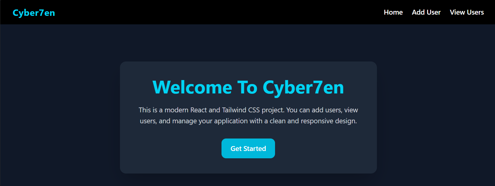

# 🚀 Practical Preparation 2025–2026

A modern full-stack web application built with React and Vite, designed to provide an efficient and interactive environment for practical preparation, user management, and frontend development practice.

---

## 📖 Overview

Practical Preparation 2025–2026 is a scalable and responsive web application focused on improving practical workflows and demonstrating modern frontend development practices.

The project uses reusable React components, clean UI structure, and a maintainable codebase architecture suitable for learning, portfolio presentation, and future expansion into a complete production-ready platform.

---

## ✨ Features

- ⚡ Fast React + Vite development environment
- 🎨 Responsive and modern UI
- 👤 User management functionality
- ➕ Add new users dynamically
- 📋 View users interface
- 🧩 Reusable React components
- 📱 Mobile-friendly layout
- 🛠️ ESLint integration for clean code
- 📂 Organized project structure

---

## 🛠️ Tech Stack

### Frontend
- React.js
- Vite
- JavaScript (ES6+)
- CSS3

### Development Tools
- Git
- GitHub
- npm
- ESLint

---

## 📂 Project Structure

```bash
Practical-Preparation-2025-2026/
│
├── Frontend/
│   ├── public/
│   ├── src/
│   │   ├── Components/
│   │   │   ├── adduser.jsx
│   │   │   ├── home.jsx
│   │   │   ├── navbar.jsx
│   │   │   └── viewusers.jsx
│   │   │
│   │   ├── assets/
│   │   ├── App.jsx
│   │   ├── main.jsx
│   │   ├── App.css
│   │   └── index.css
│   │
│   ├── package.json
│   ├── vite.config.js
│   └── README.md
│
├── screenshots/
│   └── home.png
│
└── README.md
```

---

## ⚙️ Installation & Setup

### 1️⃣ Clone the Repository

```bash
git clone https://github.com/cyber7en/Practical-Preparation-2025-2026.git
```

---

### 2️⃣ Navigate Into the Project

```bash
cd Practical-Preparation-2025-2026
```

---

### 3️⃣ Install Dependencies

```bash
npm install
```

---

### 4️⃣ Start Development Server

```bash
npm run dev
```

---

## 📸 Application Preview

### 🏠 Home Page



---

## 🚀 Future Improvements

- 🔐 Authentication system
- 🗄️ Backend API integration
- ☁️ Database support
- 📊 Admin dashboard
- 🌙 Dark mode support
- 📡 REST API integration
- 🚀 Deployment optimization

---

## 🤝 Contributing

Contributions are welcome.

To contribute:

### Create a New Branch

```bash
git checkout -b feature-name
```

### Commit Your Changes

```bash
git commit -m "Add new feature"
```

### Push to GitHub

```bash
git push origin feature-name
```

### Open a Pull Request

---

## 📄 License

This project is licensed under the MIT License.

---

## 👨‍💻 Author

### Cyber7en

- GitHub: https://github.com/cyber7en

---

## ⭐ Support

If you found this project useful, consider giving it a ⭐ on GitHub.
